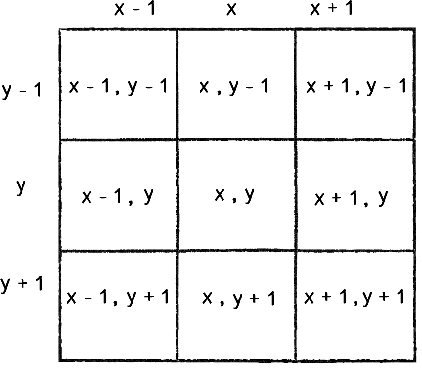

## Conway's Game of Life implemented in js(reactjs as view layer)

[Conway's Game of Life](https://en.wikipedia.org/wiki/Conway%27s_Game_of_Life)

[Online Demo](https://dongyuwei.github.io/life-game/)

## 康威生命游戏 游戏规则

任何一个单元格在同一时刻最多有 8 个邻居单元格。

- Any live cell with two or three live neighbours survives.
- Any dead cell with three live neighbours becomes a live cell.
- All other live cells die in the next generation. Similarly, all other dead cells stay dead.

## Reference

- [cellular-automata](https://natureofcode.com/book/chapter-7-cellular-automata/)
  

## 实现要点

不要直接改变当前二维数组内 Cells（state），每个迭代都根据当前二维数组内 neighbors（3~8 个相邻单元格）的状态来生成一份新的二维数组。视图更新就交给 reactjs（或者 vuejs 也是可以的）。

## 性能优化

`master`分支的代码运行时 CPU 占用较高，`native-dom-rerender`这个分支使用原生 DOM API 重新渲染表格，CPU 占用大大降低。

更新：native-dom-rerender 分支已经合并到 master 分支。

> 实现康威生命游戏最合适的数据结构是二维数组，react 对于这种表格类型的渲染（100 行 60 列，每个单元格是否需要重新渲染随机性比较大）太耗 CPU，100 毫秒迭代一次的话，用 react 重新渲染 cpu 大约占用 120%~130%，用原生 DOM API 来更新的话，cpu 占用下降到 34%左右。200 毫秒迭代一次的话 cpu 占用大约稳定在 17%左右。react 重新渲染做的事情太多了，很难优化掉。

`iterate`(主要是`getAliveNeighbors`) 方法也做了重构优化，比之前的版本性能好得多（100 多毫秒降到 10 几毫秒）。

This project was bootstrapped with [Create React App](https://github.com/facebook/create-react-app).

## Available Scripts

In the project directory, you can run:

### `npm start`

Runs the app in the development mode. 
Open [http://localhost:3000](http://localhost:3000) to view it in the browser.

The page will reload if you make edits. 
You will also see any lint errors in the console.

### `npm test`

Launches the test runner in the interactive watch mode. 
See the section about [running tests](https://facebook.github.io/create-react-app/docs/running-tests) for more information.

### `npm run build`

Builds the app for production to the `build` folder. 
It correctly bundles React in production mode and optimizes the build for the best performance.

The build is minified and the filenames include the hashes. 
Your app is ready to be deployed!

See the section about [deployment](https://facebook.github.io/create-react-app/docs/deployment) for more information.

### `npm run eject`

**Note: this is a one-way operation. Once you `eject`, you can’t go back!**

If you aren’t satisfied with the build tool and configuration choices, you can `eject` at any time. This command will remove the single build dependency from your project.

Instead, it will copy all the configuration files and the transitive dependencies (Webpack, Babel, ESLint, etc) right into your project so you have full control over them. All of the commands except `eject` will still work, but they will point to the copied scripts so you can tweak them. At this point you’re on your own.

You don’t have to ever use `eject`. The curated feature set is suitable for small and middle deployments, and you shouldn’t feel obligated to use this feature. However we understand that this tool wouldn’t be useful if you couldn’t customize it when you are ready for it.

## Learn More

You can learn more in the [Create React App documentation](https://facebook.github.io/create-react-app/docs/getting-started).

To learn React, check out the [React documentation](https://reactjs.org/).

### Code Splitting

This section has moved here: https://facebook.github.io/create-react-app/docs/code-splitting

### Analyzing the Bundle Size

This section has moved here: https://facebook.github.io/create-react-app/docs/analyzing-the-bundle-size

### Making a Progressive Web App

This section has moved here: https://facebook.github.io/create-react-app/docs/making-a-progressive-web-app

### Advanced Configuration

This section has moved here: https://facebook.github.io/create-react-app/docs/advanced-configuration

### Deployment

This section has moved here: https://facebook.github.io/create-react-app/docs/deployment

### `npm run build` fails to minify

This section has moved here: https://facebook.github.io/create-react-app/docs/troubleshooting#npm-run-build-fails-to-minify
